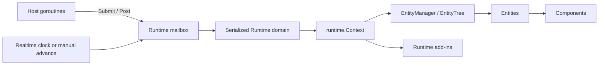

# Golaxy Tiny

**English** | [简体中文](./README.zh_CN.md)

Golaxy Tiny is a performance-oriented, embeddable Actor + EC execution kernel for game combat, rooms, simulation, and other real-time workloads. It is derived from the execution model of [Golaxy Core](https://github.com/golaxy-kit/golaxy): Tiny retains serialized Runtime domains, Entity and Component lifecycles, prototypes, entity trees, synchronous events, Future/Scope primitives, and Runtime add-ins, while leaving out Service and distributed-service infrastructure.

> **Tiny owns in-process execution and state. The host application owns networking, persistence, routing, deployment, and the mapping between external requests and Runtimes.**

## Contents

- [Positioning and boundaries](#positioning-and-boundaries)
- [Requirements and installation](#requirements-and-installation)
- [Quick start](#quick-start)
- [Execution model](#execution-model)
- [Frame modes](#frame-modes)
- [Mailbox calls](#mailbox-calls)
- [Entity and Component](#entity-and-component)
- [Prototypes and IDs](#prototypes-and-ids)
- [Async work](#async-work)
- [Runtime add-ins](#runtime-add-ins)
- [Default behavior](#default-behavior)
- [Project layout](#project-layout)
- [Development and verification](#development-and-verification)
- [Ecosystem and license](#ecosystem-and-license)

## Positioning and boundaries

Tiny is intended to be embedded in an existing Go process. A network gateway, matchmaking service, script host, test program, or command-line tool can submit work to a Runtime without adopting a prescribed service layout.

| Layer | Primary responsibility | Included infrastructure |
| --- | --- | --- |
| Golaxy Tiny | Low-overhead serialized execution and object lifecycles | Runtime, mailbox, frame loop, Entity, Component, Prototype, EntityTree, Scope, Future, add-ins |
| Golaxy Core | General-purpose in-process service and Runtime model | Service scope, global entity facilities, richer extension points, and shared utility packages |
| Golaxy Framework | Distributed service assembly | Configuration, logging, RPC, Gate, GAP/GTP, NATS, ETCD, databases, and deployment-oriented integration |

Important boundaries:

- A Runtime, not an individual Entity, is the Actor boundary. One Runtime owns one serialized execution goroutine and may manage any number of entities.
- Entity and Component form an object-composition model with lifecycles. Tiny is not a data-oriented ECS with global System queries and batch storage.
- Code outside a Runtime uses `Submit` or `Post` to mutate Runtime-owned state. Entity, Component, Prototype, and EntityTree operations do not add their own synchronization.
- Update and LateUpdate reuse Core's synchronous event implementation, including priority ordering and managed unbinding.
- Each Runtime Context owns its prototype libraries by default. They are optimized for access from the serialized domain rather than concurrent mutation.
- Entity and Component do not preallocate goroutines, `context.Context` values, signals, or async scopes. Object scopes are created only when first requested.

Tiny does not provide network listeners, RPC transport, service discovery, a configuration center, database integration, cross-process entity addressing, durable mailboxes, or automatic persistence. Add those capabilities in the host application or use Golaxy Core and Golaxy Framework when their broader service model is a better fit.

## Requirements and installation

- Go version: follow [`go.mod`](./go.mod); the current module targets Go 1.25.
- Module path: `git.golaxy.org/tiny`
- License: GNU Lesser General Public License v2.1

Install:

```bash
go get git.golaxy.org/tiny@latest
```

## Quick start

The following program creates a deterministic, manually advanced battle Runtime. The entity is added before `Run`; it is activated when the Runtime starts.

```go
package main

import (
	"context"
	"log"
	"time"

	"git.golaxy.org/tiny"
	"git.golaxy.org/tiny/ec"
	"git.golaxy.org/tiny/runtime"
)

type Movement struct {
	ec.ComponentBehavior
	X int
}

func (movement *Movement) Update() {
	movement.X++
}

func main() {
	rtCtx := runtime.NewContext(runtime.With.Name("battle-1"))

	tiny.BuildEntityPT(rtCtx, "unit").
		AddComponent(&Movement{}, "movement").
		Declare()

	rt := tiny.NewRuntime(rtCtx, tiny.With.Runtime.Frame(
		tiny.With.Frame.Mode(tiny.FrameMode_Manual),
	))

	if _, err := tiny.BuildEntity(rtCtx, "unit").New(); err != nil {
		log.Fatal(err)
	}

	terminated := rt.Run()
	waitCtx, cancel := context.WithTimeout(context.Background(), 3*time.Second)
	defer cancel()

	if ret := rt.AdvanceFrames(60).Wait(waitCtx); ret.Error != nil {
		log.Fatal(ret.Error)
	}

	rt.Terminate()
	if err := terminated.Wait(waitCtx); err != nil {
		log.Fatal(err)
	}
}
```

## Execution model



Mailbox tasks, frame callbacks, entity lifecycles, component lifecycles, and synchronous events emitted by that work execute in order on the Runtime goroutine. Multiple Runtimes can run independently; the host decides whether a Runtime represents a player, room, battle, scene, simulation shard, or short-lived computation.

The callback parameter of a mailbox task is the current `runtime.Context`. It may directly access `EntityManager`, `EntityTree`, prototype libraries, and the add-in manager. `Runtime.Context()` returns the concurrent view used for cancellation, task submission, background work, and diagnostics; it is not permission to access Runtime-local state from another goroutine.

## Frame modes

| Mode | Behavior | Typical use |
| --- | --- | --- |
| `FrameMode_Realtime` | Advances automatically at `TargetFPS` | Long-running battles, rooms, and scenes |
| `FrameMode_Manual` | Advances only through `AdvanceFrames`, `AdvanceToFrame`, or `AdvanceWhile` | Deterministic simulation, replay, tests, and on-demand computation |
| `FrameMode_Disabled` | Produces no Update or LateUpdate callbacks | Mailbox-driven state without a frame loop |

Manual advances are still mailbox tasks and therefore preserve the serialized boundary. Their Future completes with the current frame number after the requested work finishes. `TotalFrames` applies to Realtime and Manual modes; the Runtime requests termination after reaching the configured limit.

## Mailbox calls

`Runtime` and `runtime.ConcurrentContext` expose the same concurrency-safe scheduling operations:

| Operation | Result | Use |
| --- | --- | --- |
| `Submit` | Future containing a value or error | Request/response work |
| `SubmitVoid` | Future containing completion or error | Completion-sensitive commands |
| `Post` | Immediate enqueue error only | Fire-and-forget commands |
| Delegate variants | Same semantics with delegate invocation | Preserving Core's delegate call chain |

`Post` avoids allocating a Future. With a bounded queue, it can still return an immediate full or closed error. Use the top-level Tiny helpers or invoke the same methods through a Runtime/concurrent context provider.

```go
future := tiny.Submit(rt, func(ctx runtime.Context, _ ...any) async.Result {
	entity, ok := ctx.EntityManager().GetEntity(entityID)
	if !ok {
		return async.NewResult(nil, errors.New("entity not found"))
	}
	return async.NewResult(entity.CountComponents(), nil)
})
```

A Runtime cannot synchronously wait for unfinished work while executing its own callback. Waiting for a Future produced by the same Runtime is rejected with `runtime.ErrRuntimeSelfWait`; waiting for another pending Future in the Runtime goroutine is rejected with `runtime.ErrBlockingWaitInRuntime`. Use `tiny.ContinueOn` to submit the continuation back to the Runtime instead.

## Entity and Component

Entity's primary state path is:

`Born -> Entered -> Awaking -> Starting -> Alive -> Leaving -> Shutting -> Dead -> Destroyed`

An enabled Component normally follows:

`Born -> Attached -> Awaking -> Enabling -> Starting -> Alive`

Disabling an active Component moves it to `Idle`; enabling it again runs `OnEnable` and returns it through `Starting` to `Alive`, without running `Start` a second time. Removing one Component uses `Detaching`; removing an Entity shuts down its components as part of the Entity lifecycle. The terminal component path is:

`Detaching or Entity shutdown -> Shutting -> Disabling -> Dead -> Destroyed`

Lifecycle callbacks are paired with stages actually entered:

| Object | Activation | Per frame | Shutdown |
| --- | --- | --- | --- |
| Entity | `Awake`, `Start` | `Update`, `LateUpdate` | `Shut`, `Dispose` |
| Component | `Awake`, `OnEnable`, `Start` | `Update`, `LateUpdate` | `Shut`, `OnDisable`, `Dispose` |

`Shut`, `OnDisable`, and `Dispose` are called only when their corresponding `Start`, `OnEnable`, and `Awake` stages were entered. `SetEnabled` changes the requested enabled flag immediately. Before first activation it only records that flag; after activation it synchronously advances the enable/disable branch on the Runtime goroutine. Disabling a Component does not end its lifetime.

When `ComponentAwakeOnFirstTouch` is enabled, a component lookup or dependency injection during normal Entity activation can run the target Component's pending `Awake` early. This establishes a demand-driven Awake order without advancing `OnEnable` or `Start` ahead of the normal lifecycle.

Adding a Component to an Entity between `Awaking` and `Alive` synchronously advances the applicable activation stages. After an Entity reaches `Leaving`, local component-table changes remain possible, but the Runtime no longer advances newly added components beyond `Attached`. Removing a Component outside the active Entity stages removes it from the table without synthesizing lifecycle callbacks that were never entered.

For struct-field composition, `utils/assertion` provides reflection-based `As`, `Cast`, and `Inject` helpers. An `ec:"component-name,full-component-prototype"` tag can select or construct a component from the current Runtime's component library. Because this path uses reflection and can mutate the Entity, keep it in assembly, startup, and test code rather than frame-update hot paths.

The concurrent Entity and Component views expose stable identity, Runtime submission, and lifecycle scopes, but not mutable lifecycle state. An Entity must first be accepted by a Runtime, and a Component must have completed Runtime identity initialization before those views are published across goroutines. Calls made earlier are undefined behavior; defensive empty values from `AsyncScope()` or `String()` are not atomic readiness probes.

## Prototypes and IDs

Every `runtime.Context` creates its own `EntityLib` and `ComponentLib` by default. Different Runtimes may therefore register different prototype sets without paying for concurrent synchronization. Declare prototypes before starting the Runtime, or mutate the libraries only from mailbox tasks. If several Contexts share an explicitly supplied library, finish registration before startup and keep it read-only while running.

Tiny deliberately separates persistent Runtime identity from fast object-local identity:

| Identity | Type | Scope |
| --- | --- | --- |
| Runtime Context persistent ID | `uid.ID` | Automatically generated or supplied with `runtime.With.PersistID`; suitable for identifying the Runtime outside its local object table |
| Entity ID | `id.ID` (`int64`) | Unique within one Runtime |
| Component ID | `id.ID` (`int64`) | Uses the Entity ID by default, or a Runtime-local unique ID when `ComponentUniqueID` is enabled |

Entity and Component IDs should not be treated as globally unique or durable cross-process addresses. Store a separate business identifier when persistence or external addressing is required.

Components declared as part of an Entity prototype are not removable by default; `ComponentDescriptor.SetRemovable` controls that policy. Components added dynamically without a prototype descriptor are removable by default.

## Async work

The Runtime Context owns a lifecycle `async.Scope` and can be passed directly to `tiny.Spawn` or `tiny.SpawnVoid`. Runtime shutdown closes that Scope and waits for cooperative background tasks registered with it.

Entity and Component also implement `AsyncScopeProvider`, but their scopes are allocated lazily with a CAS-based publication path:

- An Entity Scope uses its Runtime Context as the parent Context.
- A Component Scope is a child of its Entity Scope.
- The corresponding Scope closes when the object reaches `Dead`.
- If no Scope existed before death, the first later access returns an already closed Scope.
- `SetEnabled(false)` does not close a Component Scope.

This keeps the common no-background-task case allocation-free while retaining object-level cancellation for timers, deferred callbacks, and occasional asynchronous work. Closing a Scope cancels its Context and rejects new tasks; it cannot forcibly stop a goroutine. Background functions must observe the supplied `context.Context` and must use `ContinueOn` or another mailbox operation before touching Runtime-owned state.

`ContinueOn` uses the provider's object Scope when available, otherwise the Runtime Scope. It reports Scope closure, enqueue failure, callback panic, and the continuation result through its returned Future.

## Runtime add-ins

Runtime add-ins provide optional behavior scoped to one Runtime without introducing Tiny's removed Service layer. They are managed through `runtime.Context.AddInManager()`.

- An add-in installed before `Run` remains `Loaded` and is activated during Runtime startup.
- An add-in installed while the Runtime is running is activated synchronously.
- Uninstalling a running add-in synchronously deactivates it; Runtime shutdown uninstalls remaining add-ins in reverse installation order.
- `LifecycleRuntimeAddInInit.Init(runtime.Context)` runs during activation.
- `LifecycleRuntimeAddInShut.Shut(runtime.Context)` runs during deactivation.
- Implement `LifecycleAddInOnRuntimeRunningEvent` to observe subsequent Runtime running events while the add-in remains active.

The add-in manager is intentionally not concurrency-safe. Install, uninstall, and inspect add-ins before `Run` or from the owning Runtime goroutine through a mailbox callback.

## Default behavior

| Setting | Default |
| --- | --- |
| Automatic start | Disabled |
| Frame mode | `FrameMode_Realtime` |
| Target frame rate | 30 FPS |
| Total frames | 0 (unlimited) |
| Task queue | Unbounded |
| Bounded queue capacity | 128 |
| Runtime GC interval | 10 seconds |
| Callback panic recovery | Disabled |
| Continue after Entity activation panic | Disabled; the failed Entity is destroyed |

An unbounded mailbox favors low-latency submission but provides no natural backpressure. Production hosts should apply admission control at their external boundaries and inspect `Runtime.Stats()`, including per-operation accepted, queued, running, completed, rejected, canceled, and panicked task counters, Scope state, wait rejection diagnostics, and last progress time.

## Project layout

| Path | Responsibility |
| --- | --- |
| Root package | Runtime loop, mailbox, frame control, lifecycles, and async helpers |
| `ec` | Entity, Component, state machines, component management, entity tree nodes, and concurrent views |
| `ec/pt` | Runtime-local Entity and Component prototype libraries |
| `runtime` | Context, EntityManager, EntityTree, running events, GC hooks, and add-ins |
| `utils/assertion` | Reflection-based component composition and injection |
| `utils/id` | Runtime-local integer IDs |

Tiny directly reuses Core's event, async, extension, generic-container, interface-cache, metadata, and option packages instead of maintaining a second set of foundational algorithms.

## Development and verification

Recommended checks:

```bash
go test ./...
go test -race ./...
go vet ./...
```

For performance-sensitive changes, keep representative workloads in benchmarks and compare both throughput and allocations:

```bash
go test -run '^$' -bench . -benchmem ./...
```

## Ecosystem and license

- [Golaxy Core](https://github.com/golaxy-kit/golaxy) provides the complete in-process Service/Runtime model and the shared utility packages used by Tiny.
- Golaxy Framework builds distributed service assembly, RPC, gateways, protocols, discovery, and database integrations on top of Core.
- Tiny is the focused choice when an application needs the serialized Runtime + EC kernel without the service and distributed layers.

Golaxy Tiny is licensed under the GNU Lesser General Public License v2.1. See [LICENSE](./LICENSE) for the complete text.
