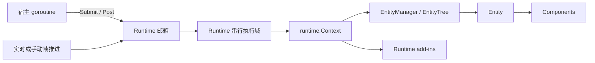

# Golaxy Tiny

Golaxy Tiny 是面向游戏战斗、房间、仿真和其他实时计算场景的轻量 Actor + EC
运行内核。它从 Golaxy Core 的执行模型裁剪而来，保留 Runtime 串行域、Entity、
Component、Prototype、实体树、同步事件、Future 和运行时插件，删除 Service 以及
分布式服务基础设施。

Tiny 适合嵌入现有进程：网络入口、匹配系统、脚本层或测试程序只需把任务投递到
Runtime，不需要采用固定的服务组织方式。

## 设计边界

- 一个 Runtime 对应一个串行执行 goroutine，可以管理任意数量的 Entity。
- Entity 和 Component 是带生命周期的对象组合模型，不是数据导向 ECS。
- Runtime 外部通过 `Submit` 或 `Post` 修改状态；实体、组件和实体树无需自行加锁。
- Entity 与 Component 使用 Runtime 本地 `int64` ID，不生成字符串型全局 ID。
- Entity 与 Component 不预创建 goroutine、`context.Context`、`Signal` 或 `AsyncScope`；
  对象级 Scope 仅在首次访问时按需创建。
- `Post` 不创建 Future；需要结果或执行错误时使用 `Submit`。
- Update 与 LateUpdate 复用 Core 的同步事件系统，支持优先级和安全解绑。
- Prototype 注册表由各 Runtime 独立持有，在串行域内直接读写，不承担并发同步成本。
- Runtime add-in 可以在运行线程中安装和卸载。

Tiny 不提供网络监听、RPC、服务发现、配置中心、数据库接入或跨进程实体寻址。
这些能力应由宿主应用负责。

## 执行模型



Runtime 是 Actor 边界，不是单个 Entity。同一 Runtime 中的邮箱任务、帧回调、实体
生命周期和同步事件都按顺序执行。多个 Runtime 可以独立运行，并由宿主决定它们与
连接、玩家、战斗或场景之间的映射关系。

## 环境与安装

Tiny 要求 Go 1.25 或更高版本。

```bash
go get git.golaxy.org/tiny@latest
```

## 快速开始

下面使用 Manual 模式构造一个可确定推进的战斗 Runtime：

```go
package main

import (
	"context"
	"log"
	"time"

	"git.golaxy.org/tiny"
	"git.golaxy.org/tiny/ec"
	"git.golaxy.org/tiny/runtime"
)

type Movement struct {
	ec.ComponentBehavior
	X int
}

func (movement *Movement) Update() {
	movement.X++
}

func main() {
	rtCtx := runtime.NewContext(runtime.With.Name("battle-1"))

	tiny.BuildEntityPT(rtCtx, "unit").
		AddComponent(&Movement{}, "movement").
		Declare()

	rt := tiny.NewRuntime(rtCtx, tiny.With.Runtime.Frame(
		tiny.With.Frame.Mode(tiny.FrameMode_Manual),
	))

	if _, err := tiny.BuildEntity(rtCtx, "unit").New(); err != nil {
		log.Fatal(err)
	}

	terminated := rt.Run()
	waitCtx, cancel := context.WithTimeout(context.Background(), 3*time.Second)
	defer cancel()

	if ret := rt.AdvanceFrames(60).Wait(waitCtx); ret.Error != nil {
		log.Fatal(ret.Error)
	}

	rt.Terminate()
	if err := terminated.Wait(waitCtx); err != nil {
		log.Fatal(err)
	}
}
```

## 帧模式

| 模式 | 行为 | 典型场景 |
| --- | --- | --- |
| `FrameMode_Realtime` | 按 `TargetFPS` 自动投递帧任务 | 常驻战斗、场景和房间 |
| `FrameMode_Manual` | 仅由 `AdvanceFrames`、`AdvanceToFrame`、`AdvanceWhile` 推进 | 确定性仿真、回放、测试、按需计算 |
| `FrameMode_Disabled` | 不产生 Update 与 LateUpdate | 纯邮箱驱动的状态对象 |

Manual 推进仍通过 Runtime 邮箱执行，返回的 Future 在目标帧完成后兑现，因此不会绕过
Actor 串行边界。`TotalFrames` 在 Realtime 和 Manual 模式中都有效；到达上限后 Runtime
会自动终止。

## 邮箱调用

Runtime 和 `runtime.ConcurrentContext` 都暴露同一组并发安全调用接口：

- `Submit`：创建 Future，返回业务值或执行错误。
- `SubmitVoid`：创建只表示完成或错误的 Future。
- `Post`：只负责入队，不创建 Future。
- Delegate 变体：保留 Core 的委托调用链能力。

```go
future := rt.Submit(func(ctx runtime.Context, _ ...any) async.Result {
	entity, ok := ctx.EntityManager().GetEntity(entityID)
	if !ok {
		return async.NewResult(nil, errors.New("entity not found"))
	}
	return async.NewResult(entity.CountComponents(), nil)
})
```

回调参数中的 `runtime.Context` 属于当前 Runtime goroutine，可以直接操作
`EntityManager`、`EntityTree`、Prototype 和 add-in。`rt.Context()` 返回并发安全视图，
用于取消、投递、后台任务和诊断，不应用它绕过邮箱访问局部状态。

Runtime 会拒绝在自身执行线程中阻塞等待尚未完成的 Future：等待本 Runtime 产生的
Future 返回 `runtime.ErrRuntimeSelfWait`，其他 pending Future 返回
`runtime.ErrBlockingWaitInRuntime`。异步结果应通过 `tiny.ContinueOn` 投递回 Runtime。

## Entity 与 Component

Entity 的主要状态链：

`Born -> Entered -> Awaking -> Starting -> Alive -> Leaving -> Shutting -> Dead -> Destroyed`

Component 的正常启用链：

`Born -> Attached -> Awaking -> Enabling -> Starting -> Alive`

Component 的启停分支与运行期单独移除链：

`Enabling / Starting / Alive -> Idle -> Starting -> Alive`

`Detaching -> Shutting -> Disabling -> Dead -> Destroyed`

`Attached` 表示 Component 尚未进入 `Awake`。正常激活会逐个推进 Component；启用
`ComponentAwakeOnFirstTouch` 后，激活期间的业务查询或依赖注入可以提前执行目标组件
尚未执行的 `Awake`，但不会提前其 `OnEnable` 或 `Start`。

`Enabling` 是首次启用阶段；从 `Idle` 重新启用时，`OnEnable` 在当前 `Idle` 状态执行，
随后经 `Starting` 回到 `Alive`，但 `Start` 不会重复执行。普通禁用在当前活动状态执行
配对的 `OnDisable` 后进入 `Idle`；`Disabling` 仅用于组件移除或随 Entity 销毁。

单独删除 Component 会经过 `Detaching`，随 Entity 销毁时则可直接进入 `Shutting`。
完整的单独移除链仅在 Entity 处于 `Awaking` 至 `Alive` 时由 Runtime 推进；其他阶段仍会
从组件表移除，但不执行 Runtime 生命周期回调。`Shut`、`OnDisable` 和 `Dispose` 分别只
与已经进入的 `Start`、`OnEnable` 和 `Awake` 配对。

`SetEnabled` 会立即改变启用标记；已依附但尚未进入 `Enabling` 的组件只记录该标记，
并在后续激活时应用。已经进入 `OnEnable` 阶段的组件禁用时会解绑帧更新并调用
`OnDisable`；重新启用会再次调用 `OnEnable`，但不会重复调用 `Start`。

可选生命周期接口包括：

| 对象 | 激活 | 每帧 | 关闭 |
| --- | --- | --- | --- |
| Entity | `Awake`、`Start` | `Update`、`LateUpdate` | `Shut`、`Dispose` |
| Component | `Awake`、`OnEnable`、`Start` | `Update`、`LateUpdate` | `Shut`、`OnDisable`、`Dispose` |

需要按结构体字段组合组件时，可以使用 `utils/assertion` 的 `As`、`Cast` 或 `Inject`。
它支持通过 `ec:"组件名,完整组件原型名"` 标签选择组件，并可从当前 Runtime 的组件原型库
构造缺失组件。该功能使用反射且可能修改实体，适合装配期、启动期或测试，不应用于帧更新
热点。

Entity 和 Component 的并发视图提供稳定身份、名称、原型、Runtime 投递入口和懒加载
`AsyncScope`。对象销毁通知可通过生命周期事件或业务自己的轻量标记表达；Tiny 不为
每个对象预分配终止 Signal。

并发视图存在明确的发布边界：Entity 必须已经成功加入 Runtime；Component 必须随
Entity 完成 Runtime 身份初始化，或已经动态加入受管 Entity。初始化期间跨 goroutine
访问属于未定义行为；`AsyncScope()` 返回 `nil` 和 `String()` 返回空字符串只是有限
防御，不能作为原子就绪探针。

运行中的 Entity 动态添加 Component 时会同步推进新组件的激活流程。Entity 进入
`Leaving` 后仍可修改本地组件表，但新增 Component 保持 `Attached`，Runtime 不再推进
其生命周期；Entity 进入 `Dead` 后，相关操作也只影响本地组件表。

## Prototype 与 ID

每个 `runtime.Context` 默认拥有独立的 `EntityLib` 与 `ComponentLib`，因此不同
Runtime 可以声明不同的原型集合。`BuildEntityPT` 声明原型，`BuildEntity` 根据原型
构造并加入当前 Runtime。原型库不提供并发保护：Runtime 启动后应在其邮箱任务中访问；
通过 `runtime.With.EntityLib` 注入共享库时，应在运行前完成声明并在运行中保持只读。

Entity 和可选的唯一 Component ID 由 Runtime 中的单线程整数生成器分配。ID 只保证
在所属 Runtime 的业务边界内使用，不应直接作为跨进程持久化标识。需要持久化身份时，
应在业务组件或元数据中保存独立字段。

Entity 原型中的 Component 默认不可动态删除，可通过 `ComponentDescriptor.SetRemovable`
声明删除策略；没有原型描述、直接动态添加的 Component 默认可删除。

## 异步任务

Runtime Context 自带一个生命周期 Scope，可直接作为 `tiny.Spawn` 的 provider。
Runtime 终止时会关闭该 Scope，并等待其中的协作式后台任务退出。

Entity 和 Component 同样实现 `AsyncScopeProvider`，但不会在构造时创建 Scope。Entity
首次访问 `AsyncScope()` 时创建以 Runtime Scope 为父级的作用域，Component 则创建以
Entity Scope 为父级的作用域。Entity 或 Component 进入 `Dead` 后，相应 Scope 会关闭；
若此前尚未创建，之后首次访问会得到立即关闭的 Scope。`SetEnabled(false)` 不会关闭
Component Scope。

这种按需作用域适合对象级超时、延迟回调和少量后台任务。Scope 关闭只负责取消和拒绝
新任务，不会强制停止 goroutine；任务仍须观察传入的 Context。后台任务不能直接修改
Runtime 状态，应使用 `ContinueOn` 返回运行线程。

## 默认配置

| 配置 | 默认值 |
| --- | --- |
| 自动启动 | 关闭 |
| 帧模式 | `FrameMode_Realtime` |
| 目标帧率 | 30 FPS |
| 总帧数 | 0，不限制 |
| 任务队列 | 无界 |
| 有界队列容量 | 128 |
| Runtime GC 间隔 | 10 秒 |
| panic 自动恢复 | 关闭 |

无界队列适合低延迟入口，但不会提供自然背压。线上宿主应监控
`Runtime.Stats().Tasks` 的排队、运行、拒绝和 panic 指标，并在网络入口实施容量控制。

## 项目结构

| 路径 | 职责 |
| --- | --- |
| 根包 | Runtime 工作循环、邮箱、帧推进、生命周期与异步辅助函数 |
| `ec` | Entity、Component、状态机、组件管理和并发视图 |
| `ec/pt` | Runtime 本地的 Entity/Component Prototype 注册表 |
| `runtime` | Context、EntityManager、EntityTree、add-in 和运行事件 |
| `utils/assertion` | 基于组件名、原型和字段类型的反射组合与注入辅助 |
| `utils/id` | Runtime 本地整数 ID |

事件、Future、Scope、通用容器和扩展接口直接复用 `git.golaxy.org/core`，避免 Tiny
维护第二套基础算法。

## 开发验证

```bash
go test ./...
go test -race ./...
go vet ./...
go test -run '^$' -bench . -benchmem ./...
```

仓库保留实体构造与 Runtime `Post` 的基准入口，便于在修改对象布局、队列或事件路径后
比较分配数和吞吐变化。

## 许可证

本项目采用 GNU LGPL 2.1 许可证，完整文本见 [LICENSE](./LICENSE)。
