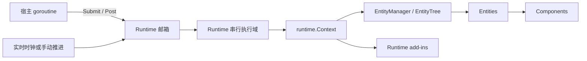

# Golaxy Tiny

[English](./README.md) | **简体中文**

Golaxy Tiny 是面向游戏战斗、房间、仿真和其他实时计算场景的高性能可嵌入式 Actor + EC 执行内核。它从 [Golaxy Core](https://github.com/golaxy-kit/golaxy) 的执行模型裁剪而来：保留 Runtime 串行域、Entity 与 Component 生命周期、Prototype、实体树、同步事件、Future/Scope 和 Runtime add-in，同时去掉 Service 与分布式服务基础设施。

> **Tiny 负责进程内执行与状态所有权；宿主应用负责网络、持久化、路由、部署，以及外部请求与 Runtime 之间的映射。**

## 目录

- [定位与边界](#定位与边界)
- [环境要求与安装](#环境要求与安装)
- [快速开始](#快速开始)
- [执行模型](#执行模型)
- [帧模式](#帧模式)
- [邮箱调用](#邮箱调用)
- [Entity 与 Component](#entity-与-component)
- [Prototype 与 ID](#prototype-与-id)
- [异步任务](#异步任务)
- [Runtime add-in](#runtime-add-in)
- [默认行为](#默认行为)
- [项目结构](#项目结构)
- [开发与验证](#开发与验证)
- [生态与许可证](#生态与许可证)

## 定位与边界

Tiny 适合嵌入已有 Go 进程。网络网关、匹配服务、脚本宿主、测试程序或命令行工具都可以向 Runtime 投递任务，而不必采用固定的服务组织方式。

| 层次 | 主要职责 | 包含的基础能力 |
| --- | --- | --- |
| Golaxy Tiny | 低开销串行执行和对象生命周期 | Runtime、邮箱、帧循环、Entity、Component、Prototype、EntityTree、Scope、Future、add-in |
| Golaxy Core | 通用进程内 Service 与 Runtime 模型 | Service 作用域、全局实体能力、更完整的扩展点和公共工具包 |
| Golaxy Framework | 分布式服务装配 | 配置、日志、RPC、Gate、GAP/GTP、NATS、ETCD、数据库和部署集成 |

需要明确以下边界：

- Actor 边界是 Runtime，而不是单个 Entity。一个 Runtime 拥有一个串行执行 goroutine，可以管理任意数量的 Entity。
- Entity 与 Component 是带生命周期的对象组合模型；Tiny 不是依赖全局 System 查询和批量存储的数据导向 ECS。
- Runtime 外部通过 `Submit` 或 `Post` 修改 Runtime 拥有的状态。Entity、Component、Prototype 和 EntityTree 操作本身不增加并发同步。
- Update 与 LateUpdate 复用 Core 的同步事件实现，支持优先级和托管解绑。
- 每个 Runtime Context 默认独立持有 Prototype 库；它们针对串行域访问优化，不承担运行期并发写入成本。
- Entity 与 Component 不预创建 goroutine、`context.Context`、Signal 或异步 Scope；对象级 Scope 仅在首次请求时创建。

Tiny 不提供网络监听、RPC 传输、服务发现、配置中心、数据库集成、跨进程实体寻址、持久化邮箱或自动落库。这些能力应由宿主应用提供；需要更完整的服务模型时，应使用 Golaxy Core 与 Golaxy Framework。

## 环境要求与安装

- Go 版本：以 [`go.mod`](./go.mod) 为准，当前为 Go 1.25。
- 模块路径：`git.golaxy.org/tiny`
- 许可证：GNU Lesser General Public License v2.1

安装：

```bash
go get git.golaxy.org/tiny@latest
```

## 快速开始

下面的程序创建一个可确定推进的 Manual 战斗 Runtime。Entity 在 `Run` 前加入，并在 Runtime 启动时激活。

```go
package main

import (
	"context"
	"log"
	"time"

	"git.golaxy.org/tiny"
	"git.golaxy.org/tiny/ec"
	"git.golaxy.org/tiny/runtime"
)

type Movement struct {
	ec.ComponentBehavior
	X int
}

func (movement *Movement) Update() {
	movement.X++
}

func main() {
	rtCtx := runtime.NewContext(runtime.With.Name("battle-1"))

	tiny.BuildEntityPT(rtCtx, "unit").
		AddComponent(&Movement{}, "movement").
		Declare()

	rt := tiny.NewRuntime(rtCtx, tiny.With.Runtime.Frame(
		tiny.With.Frame.Mode(tiny.FrameMode_Manual),
	))

	if _, err := tiny.BuildEntity(rtCtx, "unit").New(); err != nil {
		log.Fatal(err)
	}

	terminated := rt.Run()
	waitCtx, cancel := context.WithTimeout(context.Background(), 3*time.Second)
	defer cancel()

	if ret := rt.AdvanceFrames(60).Wait(waitCtx); ret.Error != nil {
		log.Fatal(ret.Error)
	}

	rt.Terminate()
	if err := terminated.Wait(waitCtx); err != nil {
		log.Fatal(err)
	}
}
```

## 执行模型



邮箱任务、帧回调、Entity 生命周期、Component 生命周期，以及执行过程中发出的同步事件，都在 Runtime goroutine 中顺序完成。多个 Runtime 可以独立运行；宿主自行决定一个 Runtime 对应玩家、房间、战斗、场景、仿真分片还是一次短时计算。

邮箱回调参数是当前 `runtime.Context`，可以直接访问 `EntityManager`、`EntityTree`、Prototype 库和 add-in 管理器。`Runtime.Context()` 返回用于取消、任务投递、后台任务和诊断的并发视图；它不表示其他 goroutine 可以绕过邮箱访问 Runtime 局部状态。

## 帧模式

| 模式 | 行为 | 典型场景 |
| --- | --- | --- |
| `FrameMode_Realtime` | 按 `TargetFPS` 自动推进 | 常驻战斗、房间和场景 |
| `FrameMode_Manual` | 仅通过 `AdvanceFrames`、`AdvanceToFrame` 或 `AdvanceWhile` 推进 | 确定性仿真、回放、测试和按需计算 |
| `FrameMode_Disabled` | 不产生 Update 与 LateUpdate 回调 | 没有帧循环的纯邮箱状态对象 |

Manual 推进仍然是邮箱任务，不会绕过 Runtime 串行边界。返回的 Future 在请求完成后以当前帧号兑现。`TotalFrames` 同时适用于 Realtime 与 Manual 模式；达到上限后 Runtime 会请求终止。

## 邮箱调用

`Runtime` 与 `runtime.ConcurrentContext` 暴露相同的并发安全调度操作：

| 操作 | 结果 | 用途 |
| --- | --- | --- |
| `Submit` | 包含业务值或错误的 Future | 请求/响应任务 |
| `SubmitVoid` | 只包含完成状态或错误的 Future | 需要确认完成的命令 |
| `Post` | 只返回同步入队错误 | 无需结果的命令 |
| Delegate 变体 | 语义相同，使用委托调用 | 保留 Core 的委托调用链 |

`Post` 不分配 Future；使用有界队列时，它仍可能立即返回队列已满或已关闭错误。既可以使用 Tiny 顶层辅助函数，也可以通过 Runtime 或并发 Context provider 调用同一组方法。

```go
future := tiny.Submit(rt, func(ctx runtime.Context, _ ...any) async.Result {
	entity, ok := ctx.EntityManager().GetEntity(entityID)
	if !ok {
		return async.NewResult(nil, errors.New("entity not found"))
	}
	return async.NewResult(entity.CountComponents(), nil)
})
```

Runtime 执行自己的回调时，不能同步等待尚未完成的任务。等待同一 Runtime 产生的 Future 会返回 `runtime.ErrRuntimeSelfWait`；在 Runtime goroutine 中等待其他 pending Future 会返回 `runtime.ErrBlockingWaitInRuntime`。异步结果应通过 `tiny.ContinueOn` 重新投递回 Runtime。

## Entity 与 Component

Entity 的主要状态路径为：

`Born -> Entered -> Awaking -> Starting -> Alive -> Leaving -> Shutting -> Dead -> Destroyed`

已启用 Component 的正常激活路径为：

`Born -> Attached -> Awaking -> Enabling -> Starting -> Alive`

禁用活动 Component 会进入 `Idle`；再次启用时会执行 `OnEnable`，并通过 `Starting` 回到 `Alive`，但不会重复执行 `Start`。单独移除 Component 使用 `Detaching`；移除 Entity 时，Component 作为 Entity 生命周期的一部分关闭。Component 的终止路径为：

`Detaching 或 Entity 关闭 -> Shutting -> Disabling -> Dead -> Destroyed`

生命周期回调只与实际进入过的阶段配对：

| 对象 | 激活 | 每帧 | 关闭 |
| --- | --- | --- | --- |
| Entity | `Awake`、`Start` | `Update`、`LateUpdate` | `Shut`、`Dispose` |
| Component | `Awake`、`OnEnable`、`Start` | `Update`、`LateUpdate` | `Shut`、`OnDisable`、`Dispose` |

只有实际进入过对应的 `Start`、`OnEnable` 和 `Awake` 阶段，才会执行 `Shut`、`OnDisable` 和 `Dispose`。`SetEnabled` 会立即改变期望的启用标记：首次激活前只记录标记，激活后则在 Runtime goroutine 中同步推进启停分支。禁用 Component 不等于结束其生命周期。

启用 `ComponentAwakeOnFirstTouch` 后，Entity 正常激活期间的组件查询或依赖注入可以提前执行目标 Component 尚未完成的 `Awake`。这样可以按实际依赖形成 Awake 顺序，但不会让 `OnEnable` 或 `Start` 越过正常生命周期提前执行。

Entity 处于 `Awaking` 至 `Alive` 时，动态添加 Component 会同步推进当前适用的激活阶段。Entity 进入 `Leaving` 后仍可修改本地组件表，但 Runtime 不再把新增 Component 推进到 `Attached` 之后。在 Entity 的活动阶段之外删除 Component，只会将其从组件表移除，不会补造从未进入过的生命周期回调。

需要按结构体字段组合组件时，`utils/assertion` 提供基于反射的 `As`、`Cast` 与 `Inject`。`ec:"组件名,完整组件原型名"` 标签可以选择组件，或从当前 Runtime 的组件原型库构造缺失组件。该路径使用反射且可能修改 Entity，适合装配期、启动期和测试，不应放在帧更新热点中。

Entity 与 Component 的并发视图只暴露稳定身份、Runtime 投递入口和生命周期 Scope，不暴露可变生命周期状态。Entity 必须先被 Runtime 接管，Component 也必须完成 Runtime 身份初始化，才能把这些视图发布给其他 goroutine。更早调用属于未定义行为；`AsyncScope()` 或 `String()` 返回空值只是有限防御，不能作为原子就绪探针。

## Prototype 与 ID

每个 `runtime.Context` 默认创建独立的 `EntityLib` 和 `ComponentLib`，因此不同 Runtime 可以注册不同的 Prototype 集合，同时避免并发同步成本。应在 Runtime 启动前声明 Prototype，或者只在邮箱任务中修改原型库。多个 Context 显式共享原型库时，应在启动前完成注册，并在运行期间保持只读。

Tiny 明确区分 Runtime 的持久化身份与对象的高效本地身份：

| 身份 | 类型 | 范围 |
| --- | --- | --- |
| Runtime Context 持久化 ID | `uid.ID` | 自动生成，或通过 `runtime.With.PersistID` 指定；可用于在本地对象表之外标识 Runtime |
| Entity ID | `id.ID`（`int64`） | 仅在单个 Runtime 内唯一 |
| Component ID | `id.ID`（`int64`） | 默认复用 Entity ID；启用 `ComponentUniqueID` 后改为 Runtime 本地唯一 ID |

不应把 Entity 与 Component ID 当作全局唯一或可持久化的跨进程地址。需要持久化或外部寻址时，应另存业务 ID。

Entity Prototype 内声明的 Component 默认不可删除，可以用 `ComponentDescriptor.SetRemovable` 控制；没有 Prototype 描述、直接动态添加的 Component 默认可删除。

## 异步任务

Runtime Context 自带生命周期 `async.Scope`，可以直接传给 `tiny.Spawn` 或 `tiny.SpawnVoid`。Runtime 关闭时会关闭该 Scope，并等待登记在其中的协作式后台任务退出。

Entity 与 Component 同样实现 `AsyncScopeProvider`，但通过 CAS 发布路径懒创建 Scope：

- Entity Scope 以 Runtime Context 作为父 Context。
- Component Scope 以 Entity Scope 为父级。
- 对象进入 `Dead` 时关闭对应 Scope。
- 如果对象死亡前从未创建 Scope，之后首次访问会返回已经关闭的 Scope。
- `SetEnabled(false)` 不会关闭 Component Scope。

这样能让不使用后台任务的常见对象保持零 Scope 分配，同时仍支持对象级取消、定时器、延迟回调和少量异步工作。关闭 Scope 只会取消 Context 并拒绝新任务，无法强制停止 goroutine；后台函数必须观察传入的 `context.Context`，并在访问 Runtime 状态前通过 `ContinueOn` 或其他邮箱操作返回串行域。

`ContinueOn` 会优先使用 provider 的对象 Scope，没有时使用 Runtime Scope。Scope 关闭、入队失败、回调 panic 和续体结果都会通过它返回的 Future 报告。

## Runtime add-in

Runtime add-in 用于给单个 Runtime 扩展可选行为，不需要重新引入 Tiny 已移除的 Service 层。它们通过 `runtime.Context.AddInManager()` 管理。

- `Run` 前安装的 add-in 保持 `Loaded`，并在 Runtime 启动时激活。
- Runtime 运行中安装 add-in 会同步激活。
- 卸载运行中的 add-in 会同步停用；Runtime 关闭时按安装顺序的逆序卸载剩余 add-in。
- 激活时调用 `LifecycleRuntimeAddInInit.Init(runtime.Context)`。
- 停用时调用 `LifecycleRuntimeAddInShut.Shut(runtime.Context)`。
- 实现 `LifecycleAddInOnRuntimeRunningEvent` 可以在 add-in 活动期间接收后续 Runtime 运行事件。

add-in 管理器刻意不提供并发保护。安装、卸载和查询应在 `Run` 前完成，或者通过邮箱回调在所属 Runtime goroutine 中执行。

## 默认行为

| 配置 | 默认值 |
| --- | --- |
| 自动启动 | 关闭 |
| 帧模式 | `FrameMode_Realtime` |
| 目标帧率 | 30 FPS |
| 总帧数 | 0，不限制 |
| 任务队列 | 无界 |
| 有界队列容量 | 128 |
| Runtime GC 间隔 | 10 秒 |
| 回调 panic 自动恢复 | 关闭 |
| Entity 激活 panic 后继续 | 关闭；销毁激活失败的 Entity |

无界邮箱有利于降低投递延迟，但不会自然形成背压。生产环境应在外部入口实施容量控制，并检查 `Runtime.Stats()`：其中包括 Submit/Post/Frame 各自的接收、排队、运行、完成、拒绝、取消和 panic 计数，以及 Scope 状态、等待拒绝诊断和最后进展时间。

## 项目结构

| 路径 | 职责 |
| --- | --- |
| 根包 | Runtime 循环、邮箱、帧控制、生命周期和异步辅助函数 |
| `ec` | Entity、Component、状态机、组件管理、实体树节点和并发视图 |
| `ec/pt` | Runtime 本地 Entity 与 Component Prototype 库 |
| `runtime` | Context、EntityManager、EntityTree、运行事件、GC 钩子和 add-in |
| `utils/assertion` | 基于反射的组件组合与注入 |
| `utils/id` | Runtime 本地整数 ID |

Tiny 直接复用 Core 的 event、async、extension、通用容器、接口缓存、元数据和 option 包，不维护第二套基础算法。

## 开发与验证

建议执行：

```bash
go test ./...
go test -race ./...
go vet ./...
```

修改性能敏感路径时，应保留有代表性的工作负载，并同时比较吞吐与分配：

```bash
go test -run '^$' -bench . -benchmem ./...
```

## 生态与许可证

- [Golaxy Core](https://github.com/golaxy-kit/golaxy) 提供完整的进程内 Service/Runtime 模型，以及 Tiny 复用的公共工具包。
- Golaxy Framework 在 Core 之上提供分布式服务装配、RPC、网关、协议、服务发现和数据库集成。
- 当应用只需要 Runtime 串行域与 EC 内核，不需要 Service 和分布式层时，Tiny 是更聚焦的选择。

Golaxy Tiny 采用 GNU Lesser General Public License v2.1，完整文本见 [LICENSE](./LICENSE)。
